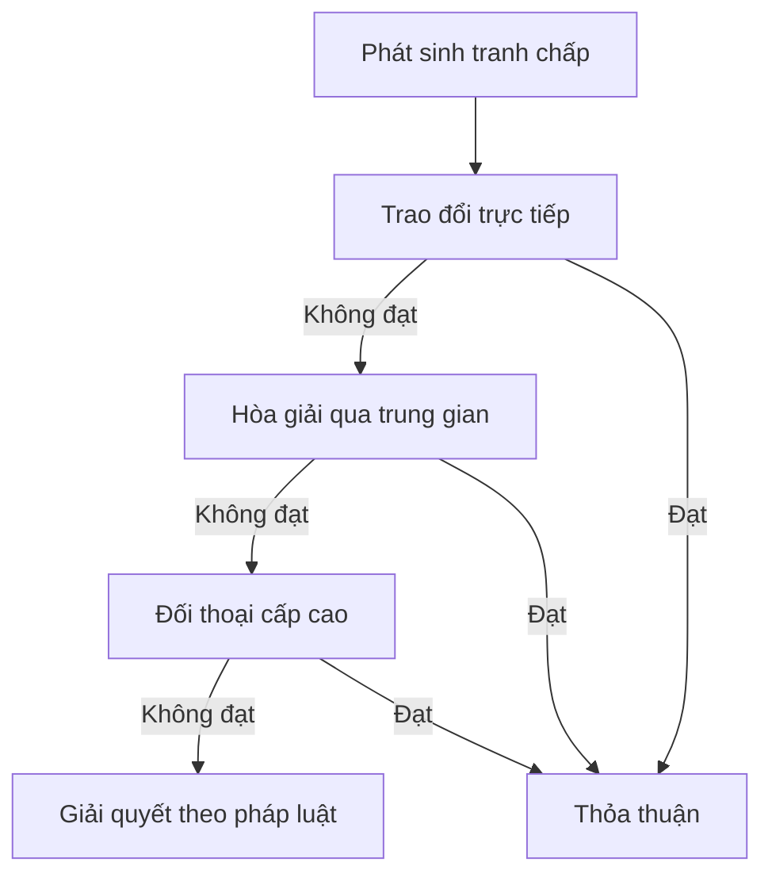

### Quyền cập nhật

:::note[Linh hoạt và kịp thời]
Chính sách có thể được cập nhật hoặc điều chỉnh để phù hợp với hệ thống và pháp luật hiện hành.
:::

**Lý do cập nhật:**

| Lý do | Mô tả |
|-------|-------|
| **Pháp luật** | Tuân thủ quy định pháp luật mới |
| **Kỹ thuật** | Thay đổi công nghệ, tính năng |
| **Bảo mật** | Tăng cường an ninh, bảo mật |
| **Vận hành** | Tối ưu quy trình, dịch vụ |
| **Phản hồi** | Cải thiện dựa trên góp ý |

---

### Quy trình cập nhật

:::tip[Minh bạch và công khai]
Phiên bản mới nhất sẽ được thông báo công khai và rõ ràng
:::

**Các bước:**

1. **Soạn thảo**: Xây dựng nội dung cập nhật
2. **Xem xét**: Đánh giá tác động
3. **Thông báo**: Công bố trước khi áp dụng
4. **Chờ đợi**: Thời gian chuyển tiếp
5. **Áp dụng**: Chính thức có hiệu lực

**Thời gian thông báo trước:**

| Loại thay đổi | Thông báo trước | Ví dụ |
|--------------|----------------|-------|
| 🔴 **Quan trọng** | 30 ngày | Thay đổi giá, điều khoản chính |
| 🟡 **Trung bình** | 15 ngày | Thêm/bỏ tính năng |
| 🟢 **Nhỏ** | 7 ngày | Cải tiến UI, bug fix |
| ⚡ **Khẩn cấp** | Ngay lập tức | Vá lỗ hổng bảo mật |

---

### Kênh thông báo

Thông tin cập nhật sẽ được gửi qua:

- **Discord**: Thông báo trong server support
<!-- - **Bot**: Thông báo trực tiếp qua bot
- **Website**: Cập nhật trên trang chủ
- **Docs**: Cập nhật tài liệu -->

:::caution[Trách nhiệm của bạn]
Khách hàng có trách nhiệm **theo dõi** các kênh thông báo để cập nhật thông tin mới nhất.
:::

---

## Quyền từ chối cung cấp

### Điều kiện từ chối

:::warning[Quyền từ chối]
Người bán có quyền từ chối cung cấp bot cho các server có dấu hiệu vi phạm hoặc mục đích không minh bạch.
:::

**Các trường hợp:**

| Dấu hiệu | Hành động |
|---------|-----------|
| **Server cờ bạc** | Từ chối ngay lập tức |
| **Mục đích bất hợp pháp** | Từ chối và báo cáo |
| **Thông tin không rõ ràng** | Yêu cầu làm rõ |
| **Lịch sử vi phạm** | Từ chối vĩnh viễn |
| **Nội dung không phù hợp** | Từ chối |

---

## Hiệu lực của điều khoản

### Thời điểm có hiệu lực

:::note[Áp dụng ngay]
Điều khoản có hiệu lực **ngay khi khách hàng sử dụng dịch vụ**
:::

**Các hành động chấp nhận:**

- ✅ Thanh toán và kích hoạt bot
- ✅ Thêm bot vào server
- ✅ Sử dụng bất kỳ chức năng nào của bot
- ✅ Gia hạn dịch vụ

:::caution[Quan trọng]
Việc sử dụng dịch vụ = **Đồng ý toàn bộ điều khoản**, dù đã đọc hay chưa đọc.
:::

---

### Phạm vi áp dụng

**Áp dụng cho:**

- Tất cả khách hàng (cá nhân, tổ chức)
- Tất cả loại bot (booking, custom, có sẵn)
- Tất cả gói dịch vụ (basic, premium, enterprise)
- Mọi khu vực địa lý
- Suốt thời gian sử dụng dịch vụ

**Ưu tiên áp dụng:**

1. **Hợp đồng riêng** (nếu có) - Ưu tiên cao nhất
2. **Điều khoản chung** - Áp dụng chung
3. **Pháp luật** - Luôn tuân thủ

---

## Sửa đổi và bổ sung

### Quyền điều chỉnh

:::note[Linh hoạt]
Cả hai bên có thể đề xuất sửa đổi, bổ sung điều khoản (với các điều kiện nhất định)
:::

**Bên mua có thể:**

- Góp ý về chính sách
- Đề xuất cải tiến
- Báo cáo điểm chưa hợp lý
- Thương thảo điều khoản riêng (gói lớn)

**Bên bán có quyền:**

- Chấp nhận hoặc từ chối đề xuất
- Cập nhật điều khoản chung
- Ký hợp đồng riêng (nếu phù hợp)
- Điều chỉnh định kỳ

---

## Giải quyết tranh chấp

### Nguyên tắc giải quyết

:::tip[Hòa bình và thiện chí]
Ưu tiên **thương lượng và hòa giải** trước khi dùng các biện pháp khác
:::

**Quy trình:**



**Thời gian:**

| Bước | Thời gian tối đa |
|------|-----------------|
| 1️⃣ Trao đổi trực tiếp | 7 ngày |
| 2️⃣ Hòa giải | 15 ngày |
| 3️⃣ Đối thoại cấp cao | 30 ngày |
| 4️⃣ Pháp lý | Theo quy định |

---

## 📞 Thông tin liên hệ

### Bộ phận pháp lý

Mọi thắc mắc về điều khoản:

```
📧 Email: legal@example.com
💬 Discord: Legal Support Channel
📱 Hotline: 1900-xxxx (giờ hành chính)
🌐 Website: docs.example.com/legal
```

---

## 📝 Lưu ý cuối cùng

:::caution[Quan trọng]
**Đọc kỹ và hiểu rõ** toàn bộ điều khoản trước khi sử dụng dịch vụ. Nếu có bất kỳ điểm nào chưa rõ, hãy liên hệ để được giải thích chi tiết.
:::

:::tip[Khuyến nghị]
- 📖 Đọc tất cả các phần trong mục TOS
- 💾 Lưu lại bản điều khoản
- 🔔 Theo dõi các cập nhật
- 💬 Hỏi khi chưa hiểu
- ✅ Tuân thủ nghiêm túc
:::

---

**Phiên bản:** 1.0
**Ngày cập nhật cuối:** 24/01/2026
**Có hiệu lực từ:** 01/01/2026

---

:::note[Tuyên bố]
Bằng việc sử dụng dịch vụ, bạn xác nhận đã đọc, hiểu và đồng ý tuân thủ toàn bộ các điều khoản này.
:::
